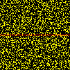
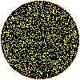
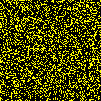

# nD Diffusion-limited aggregation

2D simulations using different starts (a line, a point and a circle)

This project is a simulation of [Diffusion-limited aggregation](https://en.wikipedia.org/wiki/Diffusion-limited_aggregation "Wikipedia page"). The simulation can be computed in any number of dimensions and visualized in 2D and 3D.

In the main you can define some parameters :
- `dim` gives the number of dimension of the environment
- `size` is the size of each dimension, if set to 10 the environment will be 10\*10\*10 (in 3D)
- `random_start` is a number between 0 and 1 giving the chance of each cell to be alive at time 0
- `max_steps` The game will stop when all cells are dead or when a given number of steps have been computed
- `angle_between_steps` if you want the gif to turn and the pov to change between each steps you can precise the angle between two steps. If you don't want it to turn, just put the value to 0
-`frames_by_step` if the gif is turning you can choose to take several pictures by step in order to make the gif more fluid
- `output_path` is the direction you want to send the pictures
- `colorz` is the function that allows to choose the colors of the cells, depending on their value.

You can start either with the createCircle() function which works for n dimensions or using customStart() with takes a list of points in entry.

Once all the pngs are into a directory, they can be trasformed into a gif using the pngs2gif.py file.